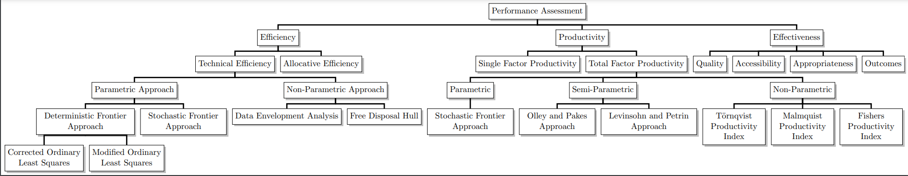

# Applied Production Analysis

## Index

***Module I: Fundamentals of Production Economics:***

→ Inputs and Outputs

→ Production function and technology set

→ Estimating production function: Cobb-Douglas and Trans-log production functions

→ Technology and Technological Constraint

→ Properties of technology: Monotonicity, Convexity and Free disposability.

***Module II: Introduction to Efficiency Analysis*:**

→ Performance Evaluation: Efficiency, Productivity and Effectiveness

→ Technical Efficiency: input oriented and output oriented

→ Allocative  efficiency and Cost Efficiency

→ Parametric approach to efficiency analysis: Corrected ordinary least squares (COLS), Modified ordinary least squares (MOLS) and Stochastic Frontier Analysis

→ Non-Parametric methods of measuring efficiency: Data Envelopment Analysis (DEA) 

→ Relaxing convexity assumption and the Free Disposal Hull (FDH) approach

→ The concept of Super-efficiency and its applications.

***Module III: Productivity Analysis:***

→ Single factor and total factor productivity

→ The Solow residual

→ Technically optimal scale

→ Measuring Total Factor Productivity Change over Time: The Törnqvist Productivity Index, The Fisher Productivity Index and the Malmquist Productivity Index

→ An introduction to Parametric and semi-parametric approaches of measuring productivity.

***Module IV: Empirical Applications of Production Economics:***

→ Application of efficiency and productivity analysis in various research fields: Health care sector, Energy, Education, Agriculture, Banking and Financial services

→ DEA for Measuring Environmental Performance

→ Bootstrap DEA and Hypothesis Testing

**Module V:: Software Packages for Efficiency and Productivity Analysis:**

→ DEAP, Frontier, R, STATA and MATLAB.

[Reference Materials](Reference-Materials-1942a432a5158089ae71f25f5d182334.md)

##
